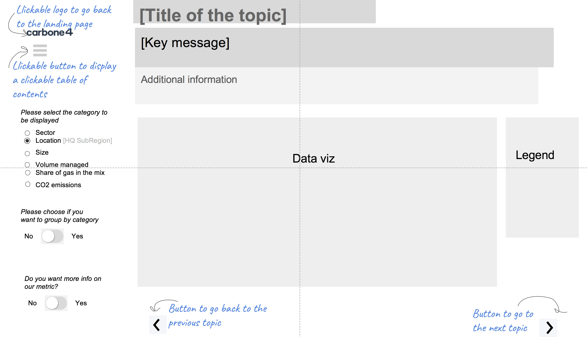
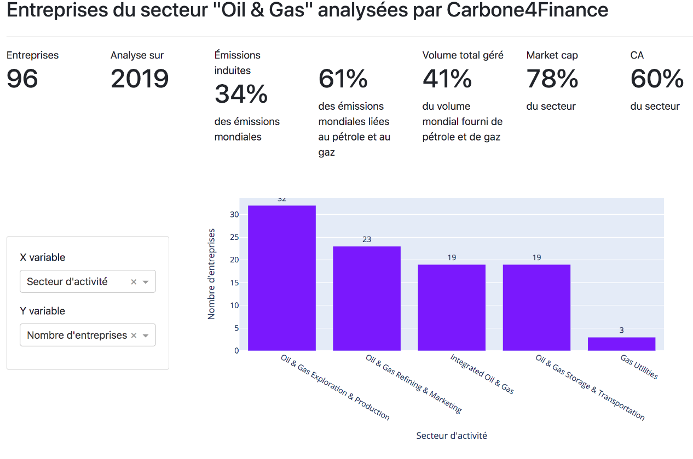
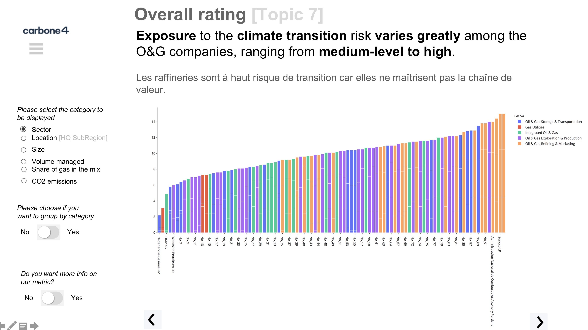

# Table of Contents

1.  [Dataset](#org9262c2c)
    1.  [Variables](#orgcc78622)
    2.  [Data sources](#orgbb13f8b)
2.  [Prototyping](#org9e436b5)
    1.  [Features](#orge688870)
    2.  [Wireframe](#org44c6c11)
        1.  [Overall structure](#org8f05c65)
        2.  [Structure of a frame](#org6d34140)
        3.  [key messages](#orga2abddc)
            -   [Key message 1](#org9d75b89)
            -   [Key message 7](#org298479c)
3.  [Development](#orgb9ab69e)
    1.  [Why did we pick Dash?](#org04158d8)
    2.  [Architecture](#org570b6d1)
        1.  [Structure of `app.py`](#orgdf86516)
            -   [Globals](#org2fe95d3)
            -   [Layout](#org4f9b46e)
            -   [Callbacks functions](#orge1302ae)
    3.  [Visual identity guidelines](#org64d3203)
        1.  [Colors](#org3af8278)
            -   [Primary colors](#orgf977e62)
            -   [Secondary colors](#orgd047554)
        2.  [Fonts](#orgb23f67d)
            -   [Primary fonts](#org372965e)
            -   [Secondary fonts](#org863ae3f)
        3.  [Logo](#org81615b4)
            -   [Symbol](#org05e239e)
            -   [Logotype](#org86a6aa4)
    4.  [How to contribute](#org5d86f6f)
        1.  [Setting up a new Git repository](#orgab97f84)
        2.  [Adding or modifying owned files (`push`)](#org709e059)
        3.  [Update local repo with the new changes in the remote repo](#orgbd8293f)
        4.  [Submit proposed changes to review (`pull-request`)](#org48d6fe7)
4.  [Tools that we used](#org5d0ec76)

# Dataset

## Variables

## Data sources

# Prototyping

## Features

## Wireframe

### Overall structure

### Structure of a frame

### key messages

#### Key message 1

#### Key message 7

# Development

## Why did we pick [Dash](https://plotly.com/dash/)?

As we wanted to use Python to build the Dashboard we had to pick among [Python dashboard libraries](https://pyviz.org/tools.html) :

According to following benchmarck the team decided to develop the PoC with ****Dash****

<table border="2" cellspacing="0" cellpadding="6" rules="groups" frame="hsides">

<colgroup>
<col  class="org-left" />

<col  class="org-left" />

<col  class="org-left" />

<col  class="org-left" />

<col  class="org-left" />
</colgroup>
<thead>
<tr>
<th scope="col" class="org-left">&#xa0;</th>
<th scope="col" class="org-left">Maturity</th>
<th scope="col" class="org-left">Popularity</th>
<th scope="col" class="org-left">Simplicity</th>
<th scope="col" class="org-left">Adaptability</th>
</tr>
</thead>

<tbody>
<tr>
<td class="org-left">Streamlit</td>
<td class="org-left">C</td>
<td class="org-left">A</td>
<td class="org-left">A</td>
<td class="org-left">C</td>
</tr>

<tr>
<td class="org-left">Dash</td>
<td class="org-left">B</td>
<td class="org-left">A</td>
<td class="org-left">B</td>
<td class="org-left">B</td>
</tr>

<tr>
<td class="org-left">Voila</td>
<td class="org-left">C</td>
<td class="org-left">C</td>
<td class="org-left">A</td>
<td class="org-left">C</td>
</tr>
</tbody>
</table>

****Maturity****: Based on the age of the project and how stable it is.

****Popularity****: Based on adoption and GitHub stars.

****Simplicity****: Based on how easy it is to get started using the library.

****Adaptability****: Based on how flexible and opinionated the library is.

## Architecture

### Structure of `app.py`

#### Globals

##### Loading libraries, style, and data

-   Libraries

-   Style

-   Pandas DataFrame

##### Data prep

##### Global functions

#### Layout

#### Callbacks functions

## Visual identity guidelines

### Colors

#### Primary colors

#### Secondary colors

### Fonts

#### Primary fonts

#### Secondary fonts

### Logo

#### Symbol

#### Logotype

## How to contribute

### Setting up a new Git repository

-   Clone project locally
    
        $ git init
        $ git clone https://github.com/dataforgoodfr/batch8_carbon4/tree/master/plateforme
-   Ask to join our GitHub

### Adding or modifying owned files (`push`)

When adding a new file or modifying a file that you own, do:

    $ git add filename
    $ git commit
    $ git push

Where `filename` is the name of the file

### Update local repo with the new changes in the remote repo

    $ git pull

### Submit proposed changes to review (`pull-request`)

When modifying an existing file, if you're not its owner, you have to submit the modifications to its owner (i.e. reviewer). Ownership is distributed as follow :

<table border="2" cellspacing="0" cellpadding="6" rules="groups" frame="hsides">

<colgroup>
<col  class="org-left" />

<col  class="org-left" />
</colgroup>
<thead>
<tr>
<th scope="col" class="org-left">Owner GitHub name</th>
<th scope="col" class="org-left">File</th>
</tr>
</thead>

<tbody>
<tr>
<td class="org-left">linetonthat</td>
<td class="org-left">`./data/*`</td>
</tr>

<tr>
<td class="org-left">morgandavidson</td>
<td class="org-left">`README.md`</td>
</tr>

<tr>
<td class="org-left">sebastienbourgeois</td>
<td class="org-left">`app.py`</td>
</tr>
</tbody>
</table>

To submit changes reviewees have to do : 

    $ git branch new-branch        #Creates a new branch nammed "new-branch"
    $ git checkout new-branch      #Switch to "new-branch"
    # alternatively these two commands can be condensed to "git checkout -b new-branch"
    $ git add filename
    $ git commit
    $ git push origin new-branch
    $ git checkout master          #Switch back to master

Then go on our [GitHub](https://github.com/dataforgoodfr/batch8_worldbank), and simply click on `compare & pull request` and pick a reviewer. Or do

-   cilck on `Pull requests`,
-   then on `New Pull Request`,
-   click on `compare across forks`,
-   select : `dataforgoodfr/batch8_carbon4 | =base: master` <- `revieweename/batch8_carbon4` | `new-branch`,
-   click on `create pull request`
-   enter GitHub reviewer name in `reviewers`, add title and comment,
-   click on `create pull request`

# Tools that we used

<table border="2" cellspacing="0" cellpadding="6" rules="groups" frame="hsides">

<colgroup>
<col  class="org-left" />

<col  class="org-left" />
</colgroup>
<thead>
<tr>
<th scope="col" class="org-left">Tools</th>
<th scope="col" class="org-left">Usage</th>
</tr>
</thead>

<tbody>
<tr>
<td class="org-left">Slack</td>
<td class="org-left">Chat</td>
</tr>

<tr>
<td class="org-left">Pycharm, Jupyter</td>
<td class="org-left">Code editing</td>
</tr>

<tr>
<td class="org-left">Git, GitHub</td>
<td class="org-left">Code storage/versioning</td>
</tr>

<tr>
<td class="org-left">Python, CSS</td>
<td class="org-left">Coding languages</td>
</tr>

<tr>
<td class="org-left">Org-mode, Github, Notion</td>
<td class="org-left">Documentation</td>
</tr>

<tr>
<td class="org-left">Zoom</td>
<td class="org-left">Meetings</td>
</tr>

<tr>
<td class="org-left">dash, pandas</td>
<td class="org-left">Python librairies</td>
</tr>

<tr>
<td class="org-left">Google Slides</td>
<td class="org-left">Wireframing</td>
</tr>
</tbody>
</table>

